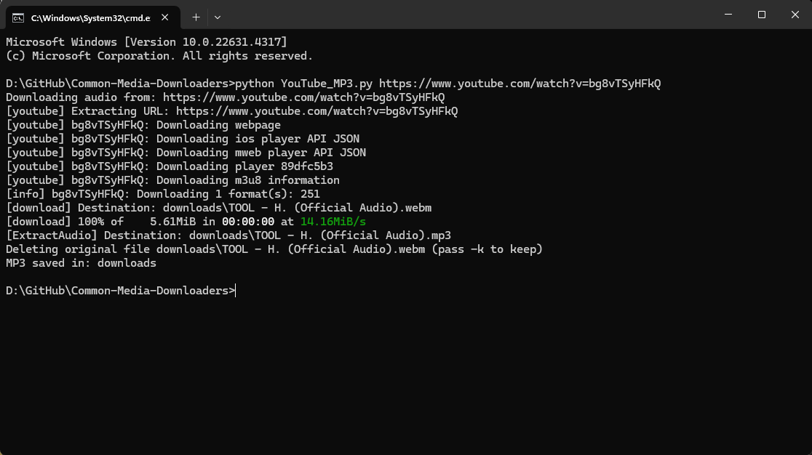

# Common Media Downloaders
A collected of python scripts that I commonly use to download online media for various purposes.

## Scripts
**YouTube_MP3.py:** Download a YouTube video as an MP3 *(I usually use this for music samples in FL Studio)*  
**YouTube_MP4.py:** Download a YouTube video as an MP4 *(I usually use this to download short meme videos)*  
**TikTok_MP4.py:** Download a TikTok as an MP4 *(I usually use this to share videos that don't allow downloads)*  
**TikTok_MP3.py:** Download a TikTok as an MP3 *(I use this to download snippets from creators like RJ Pasin)*  
**Reddit_MP4.py:** Download a Reddit video as an MP4 *(I use this rarely to download a raw video from Reddit)*  

## Usage
Call any of the python scripts and pass a link as an argument.  
Eg. `python YouTube_MP3.py https://www.youtube.com/watch?v=bg8vTSyHFkQ`  
Upon completion, the media is placed inside a directory called `downloads`.  

## Requirements
These scripts requires `yt-dlp`  
```
pip install yt-dlp
```
They also require `ffmpeg`. If you do not already have it installed, I've included a version as a `.rar` file, just extract it such that the `ffmpeg` binary is in the same folder as the scripts.  

## Preview
